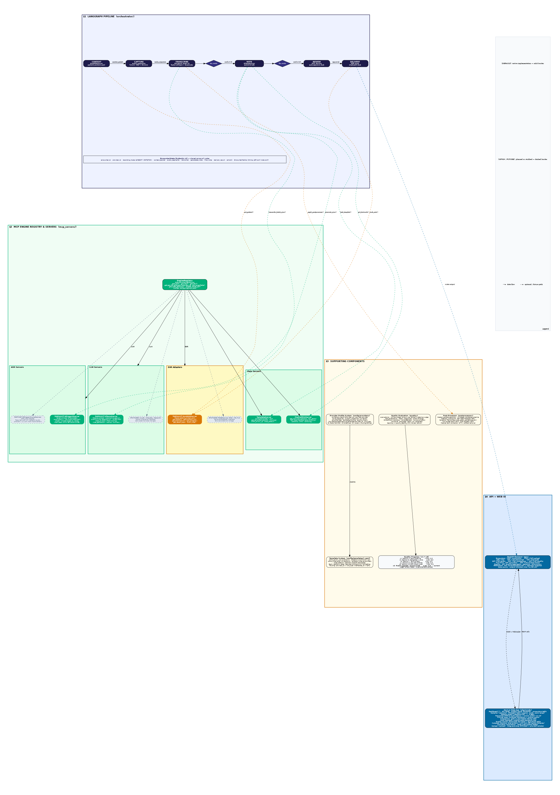

# AI Scribe — System Architecture v2.0

## 1. Design Principles

**P1: Plug-and-play everywhere.** Every intelligence layer — ASR, diarization, noise suppression, LLM, coding engine — is behind a standard interface (MCP tool server). Swapping providers is a config change, never a code change.

**P2: Self-hosted first, cloud-optional.** The default stack runs entirely on your own infrastructure. PHI never leaves your environment. HIPAA compliance is structural, not contractual. Cloud APIs (Deepgram, Claude, AWS) can be added later as additional MCP tool servers through the same interfaces.

**P3: Provider profiles govern everything.** Each clinician has a profile that controls which engines are used, which templates apply, what style the notes follow, and how aggressively corrections are applied. The system tunes itself per-provider over time.

**P4: Every correction is training data.** When a provider edits a generated note, the diff is captured as a labeled training pair. This feeds ASR post-processing refinement, LLM prompt tuning, template evolution, and eventually LoRA fine-tuning of the local LLM.

**P5: Timestamps are sacred.** Every word, speaker turn, mode switch, and addendum is anchored to a millisecond-precise timeline. This enables evidence-linked citations, audit trails, and faithful reconstruction.

**P6: LangGraph orchestrates, MCP connects tools, A2A connects agents.** The encounter pipeline is a state graph (LangGraph). Each node connects to its tools via MCP servers. Services communicate via A2A protocol for future interoperability.

**P7: PHI isolation by architecture.** The system separates provider-facing (CPU, holds PHI) and processing-pipeline (GPU, no PHI) servers at the deployment layer. Patient demographics never leave the provider-facing server. Only audio and de-identified metadata cross the boundary. This is enforced by code, config, and sync policy — not by convention.

---

## 2. System Architecture Overview



*The diagram above shows the four main layers: (1) the LangGraph pipeline (CONTEXT → CAPTURE → TRANSCRIBE → NOTE → REVIEW → DELIVERY) with the shared EncounterState flowing through all nodes; (2) the MCP Engine Registry connecting to pluggable ASR, LLM, and EHR servers; (3) supporting components including the post-processor, provider profile system, template engine, and quality evaluation framework; and (4) the dual-server deployment with FastAPI backends, Next.js web UIs, and a React Native mobile app.*

### Dual-Server Architecture

AI Scribe Enterprise is deployed as **two server roles** from a single codebase:

```
┌─────────────────────────────────────────────────────────────┐
│                       CLIENTS                               │
│   Web App (Next.js :3000)  ·  Mobile App (Expo/RN)          │
└─────────────────┬───────────────────────────────────────────┘
                  │ HTTPS
                  ▼
┌─────────────────────────────────────────────────────────────┐
│          PROVIDER-FACING SERVER  (port 8000)                │
│                                                             │
│  FastAPI: encounter browsing, EHR/patient access, audio     │
│  capture, proxy to pipeline. Holds PHI locally.             │
│  Web UI (port 3000): read-only dashboard for clinicians     │
│                                                             │
│  Data: ai-scribe-data/ (audio + PHI), output/ (synced)      │
│  Config: synced from pipeline server every 2 hours          │
└─────────────────┬───────────────────────────────────────────┘
                  │ HTTP (internal, authenticated)
                  │ Audio + encounter_details.json only (NO PHI)
                  ▼
┌─────────────────────────────────────────────────────────────┐
│       PROCESSING-PIPELINE SERVER  (port 8100)               │
│                                                             │
│  FastAPI: pipeline execution (ASR + LLM on GPU), admin      │
│  CRUD for providers/templates/specialties, batch processing  │
│  Admin UI (port 3100): full management dashboard            │
│                                                             │
│  Data: pipeline-data/ (received audio), pipeline-output/     │
│  Config: authoritative source for all config files          │
└─────────────────────────────────────────────────────────────┘
```

**Development:** Run two instances on the same machine — one provider-facing on port 8000, one pipeline on port 8100. Each instance uses the `AI_SCRIBE_SERVER_ROLE` env var.

**Production:** Each server runs on its own machine with its own role. The provider-facing server proxies pipeline operations to the GPU server and periodically syncs config back.

> For detailed team-specific documentation, see [docs/dual_server_guide.md](dual_server_guide.md).

---

## 3. Deployment Architecture

The dual-server split is the primary architectural boundary of the system. Every API route, data directory, feature flag, and sync mechanism is driven by the server role.

### 3.1 Server Roles

| Property | Provider-Facing Server | Processing-Pipeline Server |
|----------|----------------------|---------------------------|
| **Role value** | `provider-facing` | `processing-pipeline` |
| **Purpose** | Serves clinicians — encounter browsing, capture, patient lookup | Runs GPU pipeline, admin ops, template/provider management |
| **API Port** | 8000 | 8100 |
| **Web UI Port** | 3000 (Provider Portal) | 3100 (Admin UI) |
| **Data Dir** | `ai-scribe-data/` | `pipeline-data/` |
| **Output Dir** | `output/` | `pipeline-output/` |
| **Config** | Synced from pipeline | Authoritative source |
| **GPU Required** | No | Yes (WhisperX, Ollama) |
| **EHR Access** | Yes (local) | No |
| **Admin CRUD** | Read-only | Full |
| **Mobile App** | Connects here | N/A |

### 3.2 Role Selection

The server role is determined by `config/deployment.yaml` or overridden by `AI_SCRIBE_SERVER_ROLE`:

```bash
# Provider-facing server
AI_SCRIBE_SERVER_ROLE=provider-facing uvicorn api.main:app --port 8000

# Processing-pipeline server
AI_SCRIBE_SERVER_ROLE=processing-pipeline uvicorn api.main:app --port 8100

# Development (two instances on the same machine)
AI_SCRIBE_SERVER_ROLE=provider-facing uvicorn api.main:app --reload --port 8000
AI_SCRIBE_SERVER_ROLE=processing-pipeline uvicorn api.main:app --reload --port 8100
```

The role drives two resolution chains:
1. **API route mounting** (`api/main.py`): Routers are conditionally included based on `cfg.is_provider_facing` / `cfg.is_processing_pipeline`.
2. **Data directory resolution** (`config/paths.py`): `DATA_DIR` and `OUTPUT_DIR` resolve to different paths per role.

### 3.3 PHI Isolation

Patient demographics **never leave the provider-facing server**. The proxy layer (`api/proxy.py`) enforces this:

| Data | Provider Server | Pipeline Server |
|------|:-:|:-:|
| `patient_demographics.json` (name, DOB, MRN) | Stored | **NEVER sent** |
| `patient_context.yaml` (clinical context with names) | Stored | **NEVER sent** |
| `final_soap_note.md` (gold standard with patient names) | Stored | **NEVER sent** |
| Audio files (voice data, needed for ASR) | Stored | Sent for processing |
| `encounter_details.json` (mode, visit_type, provider_id) | Stored | Sent (de-identified) |
| Generated notes (clinical content) | Synced back | Generated here |
| Templates, providers, dictionaries | Synced from pipeline | Authoritative source |

### 3.4 Inter-Server Communication

**Proxy pattern (provider → pipeline):** When the provider-facing server receives a pipeline operation (create encounter, upload audio, poll status), `api/proxy.py` forwards it:

```python
# api/proxy.py — simplified flow
client = httpx.AsyncClient(base_url="http://pipeline-server:8100")
resp = await client.post("/pipeline/upload", files={"audio": ...}, data={...})
# Only sends audio + encounter_details.json, NEVER PHI
```

**Config sync (pipeline → provider):** Background `asyncio` task in `api/sync.py` pulls every 2 hours:
- `GET /providers` → writes `config/providers/*.yaml`
- `GET /templates` → writes `config/templates/*.yaml`
- `GET /specialties` → writes `config/dictionaries/*.txt`

**Inter-server auth:** When `security.inter_server_auth.enabled: true` in `deployment.yaml`, all proxy requests include `X-Inter-Server-Auth` header with a shared secret from the `AI_SCRIBE_INTER_SERVER_SECRET` env var.

### 3.5 API Route Map by Role

**Shared routes (mounted on both servers):**
- `GET /encounters`, `GET /encounters/{id}`, `/note`, `/transcript`, `/comparison`, `/quality`
- `GET /quality/aggregate`, `GET /quality/by-provider`
- `WS /ws/encounters/{id}` (real-time pipeline progress)
- `GET /config/features`, `GET /config/role`, `GET /health`

**Provider-facing only (port 8000):**
- `GET /patients/search` — EHR patient roster (local data, never proxied)
- `GET /providers`, `GET /providers/{id}` — read-only
- `POST /encounters` — create encounter → proxied to pipeline
- `POST /encounters/{id}/upload` — upload audio → proxied to pipeline

**Processing-pipeline only (port 8100):**
- `POST /pipeline/upload`, `POST /pipeline/trigger/{job_id}`, `GET /pipeline/status/{job_id}`
- `GET /pipeline/output/{id}/note`, `GET /pipeline/output/{id}/transcript`
- `POST /pipeline/batch/upload`, `POST /pipeline/batch/trigger`
- `GET/POST/PUT /providers` — full CRUD
- `GET/POST/PUT/DELETE /templates` — full CRUD
- `GET/POST/PUT/DELETE /specialties` — full CRUD

### 3.6 Client Applications

**Web app** (`client/web/`): A single Next.js codebase serves both roles. The `NEXT_PUBLIC_API_URL` env var determines which API it connects to:
- Port 3000 → provider-facing API (8000): read-only dashboard, Capture page, no admin CRUD
- Port 3100 → pipeline API (8100): full admin UI with provider/template/specialty management

**Mobile app** (`client/mobile/`): React Native/Expo app connects to the provider-facing server (port 8000). API URL is configurable at runtime via the Settings screen (supports Cloudflare tunnel URLs for remote access).

### 3.7 Data Directory Layout

```
ai-scribe-enterprise/
├── ai-scribe-data/              ← Provider-facing DATA_DIR
│   └── {mode}/{provider_id}/{sample_id}/
│       ├── audio.mp3
│       ├── patient_demographics.json    ← PHI (stays local)
│       ├── encounter_details.json       ← de-identified (sent to pipeline)
│       └── patient_context.yaml         ← PHI (stays local)
│
├── output/                      ← Provider-facing OUTPUT_DIR (synced from pipeline)
│   └── {mode}/{provider_id}/{sample_id}/
│       ├── generated_note_v8.md
│       └── audio_transcript_v8.txt
│
├── pipeline-data/               ← Pipeline DATA_DIR (received from provider)
│   └── {mode}/{provider_id}/{sample_id}/
│       ├── audio.mp3
│       └── encounter_details.json
│
├── pipeline-output/             ← Pipeline OUTPUT_DIR (generated by GPU pipeline)
│   └── {mode}/{provider_id}/{sample_id}/
│       ├── generated_note_v8.md
│       ├── audio_transcript_v8.txt
│       └── quality_report.md
│
└── config/                      ← Authoritative on pipeline; synced to provider
    ├── deployment.yaml
    ├── engines.yaml
    ├── providers/*.yaml
    ├── templates/*.yaml
    └── dictionaries/*.txt
```

### 3.8 Feature Flags

Feature flags control what each server role can do (`config/deployment.py: FeatureFlags`):

| Feature | Provider-Facing | Pipeline | Both |
|---------|:-:|:-:|:-:|
| Dashboard, view encounters/providers/quality | Yes | Yes | Yes |
| Record audio, trigger pipeline (proxied) | Yes | — | Yes |
| EHR access, patient search | Yes | — | Yes |
| Run pipeline (GPU) | — | Yes | Yes |
| Batch processing | — | Yes | Yes |
| Create/edit providers, templates, specialties | — | Yes | Yes |

Every route calls `require_feature(name)` — returns HTTP 403 if the feature is not enabled for the current role.

---

## 4. Technology Stack (All Self-Hosted)

### 4.1 Complete Component Inventory

```
LAYER              COMPONENT                    LICENSE          ROLE
─────────────────────────────────────────────────────────────────────────────
AUDIO              DeepFilterNet                MIT              Noise suppression
                   Silero VAD                   MIT              Voice activity detection
                   FFmpeg                       LGPL 2.1         Audio format conversion

ASR (Batch)        WhisperX                     MIT              Primary ASR engine
                     faster-whisper             MIT              CTranslate2 optimized Whisper
                     pyannote 3.1               MIT/CC-BY-4.0    Speaker diarization
                     wav2vec2                   MIT              Word-level alignment

ASR (Streaming)    Nemotron-Speech-Streaming     CC-BY-4.0        Real-time transcription
                   Multitalker-Parakeet         CC-BY-4.0        Multi-speaker streaming

Post-Processing    medasr_postprocessor.py      Proprietary      12-stage rule-based cleanup
                   OpenMedSpel (98K terms)      GPL 3.0          Medical dictionary
                   ByT5 ML model (future)       Proprietary      Learned correction model

LLM                Qwen 2.5 (14B/32B/72B)      Apache 2.0       Note generation, coding, summaries
                   Llama 3.1 (8B/70B)          Llama License    Alternative LLM
                   Mistral (7B/24B)            Apache 2.0       Lightweight alternative

INFERENCE          Ollama                       MIT              Default model serving (dev + prod)
                   vLLM                         Apache 2.0       High-throughput alternative

ORCHESTRATION      LangGraph                    MIT              Pipeline state graph
                   LangChain                    MIT              Tool/chain abstractions

DATA               PostgreSQL                   PostgreSQL Lic   Encounters, profiles, metrics
                   MinIO                        AGPL 3.0         Audio/file object storage
                   Valkey (Redis fork)          BSD              Message queue, session state, cache

WEB                Next.js                      MIT              Web app + review UI
                   Chrome Extension MV3         —                EHR Super Fill + voice nav

MONITORING         Grafana + Prometheus          AGPL/Apache      Metrics and dashboards

TOTAL LICENSE COST: $0/month
```

### 4.2 Infrastructure Tiers

```
TIER 1 — Proof of Concept ($260/mo)
  1x T4 16GB GPU    — WhisperX (ASR) + Qwen 2.5-14B (LLM, time-shared)
  1x CPU instance    — App server, PostgreSQL, MinIO, Valkey
  Capacity:          ~20-30 notes/day
  Note quality:      Acceptable for simple SOAP notes

TIER 2 — Production Start ($630/mo)  ★ RECOMMENDED
  1x T4 16GB GPU    — WhisperX (ASR + diarization)
  1x A10 24GB GPU   — Qwen 2.5-32B via Ollama (LLM)
  1x CPU instance    — App server, PostgreSQL, MinIO, Valkey
  Capacity:          100+ notes/day
  Note quality:      Good across most specialties

TIER 3 — Quality Maximum ($1,250/mo)
  1x T4 16GB GPU    — WhisperX + NeMo Streaming (dual ASR)
  1x A100 40GB GPU  — Qwen 2.5-72B or Llama 70B via vLLM
  2x CPU instances   — App servers, DB cluster
  Capacity:          500+ notes/day
  Note quality:      Rivals Claude/GPT-4o on clinical notes
```

---

## 5. Encounter Pipeline (LangGraph State Graph)

### 5.1 Top-Level Graph

```
                     ENCOUNTER STATE GRAPH (LangGraph)

  ┌──────────┐     ┌──────────┐     ┌──────────┐     ┌──────────┐
  │ CONTEXT  │────>│ CAPTURE  │────>│TRANSCRIBE│────>│   NOTE   │
  │  NODE    │     │  NODE    │     │  NODE    │     │   NODE   │
  └──────────┘     └────┬─────┘     └────┬─────┘     └────┬─────┘
                        │                │                │
                   [mode router]    [ASR router]    [parallel branch]
                   ambient/dictate  engine select   note+coding+summary
                        │                │                │
                        │           [confidence]          │
                        │            router              │
                        │           pass/retry            │
                        │                │                │
                   ┌────┴────┐     ┌────┴─────┐    ┌────┴─────┐
                   │  PAUSED │     │ RE-ROUTE │    │  REVIEW  │
                   │  (opt)  │     │ (fallback│    │  (HITL)  │
                   └─────────┘     │  engine) │    └────┬─────┘
                                   └──────────┘         │
                                                   ┌────┴─────┐
                                                   │ DELIVER  │
                                                   │  NODE    │
                                                   └────┬─────┘
                                                        │
                                                   ┌────┴─────┐
                                                   │ FEEDBACK │
                                                   │  NODE    │
                                                   └──────────┘
```

### 5.2 Session State Schema

The state object flows through every node, accumulating data at each stage:

```python
from pydantic import BaseModel
from typing import Optional
from enum import Enum

class EncounterState(BaseModel):
    # Identity
    encounter_id: str
    provider_id: str
    patient_id: str
    state: str  # CREATED|CONTEXT_LOADING|READY|CAPTURING|PROCESSING|REVIEWING|DELIVERED

    # Provider profile (loaded at start)
    provider_profile: ProviderProfile

    # Pre-encounter context
    context_packet: Optional[ContextPacket] = None

    # Audio capture
    audio_segments: list[AudioSegment] = []
    mode_events: list[ModeEvent] = []          # ambient/dictation switches
    voice_commands: list[VoiceCommand] = []
    typed_addendums: list[Addendum] = []

    # Transcription
    transcript: Optional[UnifiedTranscript] = None
    asr_engine_used: str = ""
    diarization_engine_used: str = ""
    postprocessor_version: str = ""
    postprocessor_metrics: dict = {}

    # Note generation
    generated_note: Optional[ClinicalNote] = None
    coding_suggestions: list[CodingSuggestion] = []
    patient_summary: Optional[PatientSummary] = None
    llm_engine_used: str = ""
    template_used: str = ""

    # Review
    corrections: list[Correction] = []
    final_note: Optional[ClinicalNote] = None

    # Delivery
    delivery_method: str = ""        # extension|fhir|clipboard
    delivery_result: Optional[dict] = None

    # Quality metrics (accumulated throughout)
    metrics: EncounterMetrics = EncounterMetrics()
```

### 5.3 Node Detail: Pre-Processing → Core → Post-Processing

Every node is itself a sub-graph with pre-processing, core execution, and post-processing steps. Each step is independently skippable, retriable, and swappable.

#### CONTEXT NODE
```
PRE:   validate_patient_id → check_ehr_connectivity → load_provider_profile → dedup_session
CORE:  fetch_ehr_data (via MCP EHR tool server)
POST:  check_completeness → optimize_context_size → minimize_phi → snapshot_context
```

#### CAPTURE NODE
```
PRE:   detect_audio_source → normalize_sample_rate → suppress_noise → normalize_gain
       → detect_voice_activity → score_audio_quality
CORE:  stream_and_buffer (chunked audio capture)
POST:  tag_chunk_metadata → detect_commands → merge_addendums → manage_offline_buffer
       → archive_audio
```

#### TRANSCRIBE NODE
```
PRE:   asr_router (CONDITIONAL EDGE: selects engine) → build_engine_config
       → inject_custom_vocab → convert_audio_format → select_batch_strategy
CORE:  transcribe (via MCP ASR tool server — WhisperX or NeMo or others)
POST:  normalize_transcript → align_diarization
       → POST-PROCESSOR SUB-GRAPH:
           ├── RULES PATH: stages 1-12 (our medasr_postprocessor.py)
           ├── ML PATH: ByT5 model (when trained)
           └── CONFIDENCE COMPARE: pick winner or flag for review
       → score_confidence → update_audio_index → quality_gate
       (quality_gate CONDITIONAL EDGE: pass → continue | fail → re-route to alt engine)
```

#### NOTE NODE
```
PRE:   assemble_prompt → select_template → inject_style_directives
       → structure_by_mode → budget_context_window → prepare_citations
CORE:  PARALLEL BRANCHES (via MCP LLM tool server — Ollama endpoint):
         ├── generate_note (SOAP/H&P/Progress)
         ├── generate_coding (E&M, HCC, CPT)
         └── generate_patient_summary (5th-grade reading level)
POST:  detect_hallucinations → validate_medical_terms (98K dict)
       → link_citations → validate_coding → enforce_style
       → check_readability → check_completeness → score_confidence
```

#### REVIEW NODE
```
PRE:   render_for_editor → highlight_low_confidence → prepare_diff → preload_audio_clips
CORE:  human_review (HITL — waits for provider approval)
POST:  capture_corrections → classify_corrections (ASR_ERROR|STYLE|CONTENT|CODING|TEMPLATE)
       → generate_training_pairs → update_style_model → refine_template → log_quality
```

#### DELIVERY NODE
```
PRE:   map_ehr_fields → convert_format → select_delivery_method → tag_phi_audit
CORE:  push_to_ehr (via MCP EHR tool server or browser extension)
POST:  confirm_delivery → write_audit_log → apply_retention_policy
       → finalize_encounter → emit_quality_metrics
```

---

## 6. MCP Tool Servers (Plug-and-Play Layer)

Every external capability is wrapped in an MCP server with a standard interface. The LangGraph nodes call tools via MCP — they never call engines directly.

### 6.1 ASR MCP Servers

```
mcp_servers/asr/
├── whisperx_server.py          # WhisperX (faster-whisper + pyannote + wav2vec2)
├── nemo_streaming_server.py    # NVIDIA Nemotron-Speech-Streaming
├── nemo_multitalker_server.py  # NVIDIA Multitalker-Parakeet-Streaming
├── deepgram_server.py          # Deepgram Nova-3 Medical (future cloud option)
├── aws_transcribe_server.py    # AWS Transcribe Medical (future cloud option)
└── base.py                     # Common ASREngine interface

# Interface (all servers implement this):
tools:
  - transcribe_batch(audio_path, config) → RawTranscript
  - transcribe_stream(audio_chunk, session) → PartialTranscript
  - get_capabilities() → {streaming, diarization, medical_vocab, max_speakers}
```

### 6.2 LLM MCP Servers

```
mcp_servers/llm/
├── ollama_server.py            # Ollama (default — dev + prod)
├── vllm_server.py              # vLLM (high-throughput production)
├── claude_server.py            # Anthropic Claude (future cloud option)
├── openai_server.py            # OpenAI GPT-4o (future cloud option)
└── base.py                     # Common LLMEngine interface

# Interface (all servers implement this):
tools:
  - generate(system_prompt, messages, config) → LLMResponse
  - generate_stream(system_prompt, messages, config) → AsyncIterator[LLMChunk]
  - get_model_info() → {model_name, context_window, capabilities}

# The Ollama server simply proxies to Ollama's OpenAI-compatible API:
#   http://localhost:11434/v1/chat/completions
# vLLM, Claude, OpenAI all expose the same /v1/chat/completions endpoint.
# Switching between them is a URL + API key config change.
```

### 6.3 EHR MCP Servers

```
mcp_servers/ehr/
├── fhir_server.py              # FHIR R4 (Epic, Cerner, Athena)
├── hl7v2_server.py             # HL7v2 (legacy systems)
├── extension_scrape_server.py  # Browser extension DOM scraping
├── manual_server.py            # Manual entry (provider types context)
└── base.py                     # Common EHRAdapter interface

# Interface:
tools:
  # READ (pre-encounter context)
  - get_patient(identifier) → PatientDemographics
  - get_problem_list(patient_id) → Problem[]
  - get_medications(patient_id) → Medication[]
  - get_allergies(patient_id) → Allergy[]
  - get_recent_labs(patient_id, days) → LabResult[]
  - get_last_visit_note(patient_id) → ClinicalNote

  # WRITE (post-encounter delivery)
  - push_note(patient_id, note) → PushResult
  - push_order(patient_id, order) → PushResult

  # NAVIGATE (voice commands)
  - navigate(command) → NavigationResult
```

### 6.4 Audio Processing MCP Servers

```
mcp_servers/audio/
├── deepfilternet_server.py     # DeepFilterNet noise suppression
├── rnnoise_server.py           # RNNoise (lighter alternative)
├── silero_vad_server.py        # Silero Voice Activity Detection
├── ffmpeg_server.py            # Audio format conversion + resampling
└── base.py                     # Common AudioProcessor interface

# Interface:
tools:
  - suppress_noise(audio, aggressiveness) → CleanedAudio
  - detect_voice_activity(audio, sensitivity) → VADSegments
  - convert_format(audio, target_format, sample_rate) → ConvertedAudio
  - estimate_snr(audio) → QualityScore
```

### 6.5 Data/Reference MCP Servers

```
mcp_servers/data/
├── medical_dict_server.py      # 98K OpenMedSpel + custom vocabulary
├── icd10_server.py             # ICD-10 code lookup
├── cpt_server.py               # CPT code lookup
├── drug_db_server.py           # Drug name/interaction database
├── template_server.py          # Note templates (SOAP, H&P, specialty-specific)
└── base.py                     # Common interface

# Interface:
tools:
  - lookup_medical_term(term) → {found, suggestions}
  - lookup_icd10(description) → ICD10Code[]
  - lookup_cpt(procedure) → CPTCode[]
  - lookup_drug(name) → DrugInfo
  - get_template(specialty, note_type) → NoteTemplate
  - get_custom_vocabulary(provider_id) → string[]
```

---

## 7. Engine Registry and Routing

### 7.1 Engine Registry

All MCP servers register with the Engine Registry at startup. The registry tracks health, capabilities, and quality metrics.

```python
class EngineRegistry:
    engines: dict[EngineType, list[RegisteredEngine]]

    def register(type, name, mcp_server_url, capabilities, config)
    def select(type, provider_profile, context) → SelectedEngine
    def select_with_fallback(type, provider_profile) → list[SelectedEngine]
    def health_check(type, name) → HealthStatus
    def record_quality(type, name, provider_id, score)
    def get_quality_scores(type, provider_id) → dict[engine_name, score]
```

### 7.2 ASR Router Decision Logic

```python
def select_asr_engine(profile, audio_meta, registry):
    # 1. Provider override?
    if profile.asr_override:
        return registry.get(profile.asr_override)

    # 2. A/B test assignment?
    if ab_test.is_active(profile):
        return ab_test.get_assignment(profile)

    # 3. Capability filter
    candidates = registry.get_healthy("asr")
    if audio_meta.mode == "ambient" and audio_meta.speakers > 1:
        candidates = [e for e in candidates if e.supports_diarization]
    if audio_meta.needs_streaming:
        candidates = [e for e in candidates if e.supports_streaming]

    # 4. Score by historical quality for this provider
    scored = [(e, registry.get_quality(e, profile.id)) for e in candidates]
    scored.sort(key=lambda x: -x[1])

    return EngineSelection(
        primary=scored[0][0],
        fallback=scored[1][0] if len(scored) > 1 else None,
    )
```

### 7.3 LLM Router Decision Logic

```python
def select_llm_engine(profile, task, registry):
    # Task-based selection (different tasks may use different models)
    # e.g., note_generation → 32B model, patient_summary → 14B model
    candidates = registry.get_healthy("llm")

    # Provider override?
    if profile.llm_override:
        return registry.get(profile.llm_override)

    # Task-based default
    task_defaults = {
        "note_generation": "qwen2.5:32b",    # needs quality
        "coding":          "qwen2.5:32b",    # needs medical knowledge
        "patient_summary": "qwen2.5:14b",    # can use smaller model
        "command_parse":   "qwen2.5:7b",     # fast, simple task
    }

    model = task_defaults.get(task, "qwen2.5:32b")
    return registry.select("llm", model_name=model)
```

---

## 8. Plug-and-Play Configuration

### 8.1 Inference Endpoints (Ollama Default)

```yaml
# config/engines.yaml

llm:
  default_server: ollama
  servers:
    ollama:
      type: ollama
      url: "http://localhost:11434/v1"
      models:
        note_generation: "qwen2.5:32b"
        coding: "qwen2.5:32b"
        patient_summary: "qwen2.5:14b"
        command_parse: "qwen2.5:7b"

    vllm:  # swap in for production throughput
      type: vllm
      url: "http://localhost:8000/v1"
      models:
        note_generation: "Qwen/Qwen2.5-32B-Instruct-AWQ"

    claude:  # future cloud option
      type: openai_compatible
      url: "https://api.anthropic.com/v1"
      api_key_env: "ANTHROPIC_API_KEY"
      models:
        note_generation: "claude-sonnet-4-20250514"

asr:
  default_server: whisperx
  servers:
    whisperx:
      type: whisperx
      model: "large-v3"
      device: "cuda"
      compute_type: "float16"
      diarization: true
      hf_token_env: "HF_TOKEN"

    nemo_streaming:
      type: nemo
      model: "nvidia/nemotron-speech-streaming-en-0.6b"
      device: "cuda"
      streaming: true

    nemo_multitalker:
      type: nemo_multitalker
      model: "nvidia/multitalker-parakeet-streaming-0.6b-v1"
      device: "cuda"
      streaming: true
      max_speakers: 5

    deepgram:  # future cloud option
      type: deepgram
      api_key_env: "DEEPGRAM_API_KEY"
      model: "nova-3-medical"

audio_processing:
  noise_suppression:
    default: deepfilternet
    options: [deepfilternet, rnnoise, passthrough]
  vad:
    default: silero
    sensitivity: 0.5

ehr:
  default_adapter: manual
  adapters:
    manual:
      type: manual
    extension:
      type: browser_extension
    fhir:
      type: fhir
      base_url_env: "FHIR_BASE_URL"

post_processing:
  mode: hybrid  # rules_only | ml_only | hybrid
  rules_pipeline: true
  ml_model_path: null  # populated after training
  medical_wordlist: "./data/medical_wordlist.txt"
  confidence_threshold: 0.85
```

### 8.2 Provider Profile

```yaml
# Each provider gets a profile that tunes the entire pipeline

provider:
  id: "dr-smith-001"
  name: "Dr. Sarah Smith"
  specialty: "orthopedic"
  npi: "1234567890"

  # Note preferences
  note_format: "SOAP"
  template: "ortho_followup_v3"
  style_directives:
    - "Use active voice"
    - "Spell out medication names fully"
    - "Include ROM in degrees"
    - "Always document neurovascular status"
  custom_vocabulary:
    - "Dr. Ramirez"
    - "St. Luke's Medical Center"
    - "Medrol Dosepak"
    - "Spurling's maneuver"

  # Engine overrides (null = use defaults from engines.yaml)
  asr_engine: null        # auto-select via router
  llm_engine: null        # auto-select via router
  noise_suppression: "aggressive"
  postprocessor_mode: "hybrid"

  # Learned (updated by feedback loop)
  style_model_version: "v0"
  correction_count: 0
  quality_scores:
    whisperx: 0.85
    nemo_streaming: null  # not yet tested
```

---

## 9. Feature → Component Traceability

```
FEATURE (from requirements)              PIPELINE COMPONENTS                 PHASE
──────────────────────────────────────────────────────────────────────────────────
P0 Multi-Speaker Diarization (N=5)       Capture.audio_capture               1
                                         Transcribe.asr_router
                                         Transcribe.whisperx (pyannote)
                                         Transcribe.nemo_multitalker (P2)

P0 Background Noise Suppression          Capture.suppress_noise              1
                                         (MCP: deepfilternet_server)

P0 Hybrid Ambient/Dictation Toggle       Capture.mode_controller             1
                                         Orchestrator.session_state
                                         Note.structure_by_mode

P0 EHR "Super Fill" / Extension          Delivery.browser_extension          1
                                         Delivery.map_ehr_fields
                                         (MCP: extension_scrape_server)

P0 Offline Audio Buffering               Capture.offline_buffer (IndexedDB)  1
                                         Delivery.sync_engine

P1 Evidence-Linked Citations             Transcribe.audio_indexer            2
                                         Note.prepare_citations
                                         Note.link_citations
                                         Review.preload_audio_clips

P1 Self-Learning Personalization         Review.capture_corrections          2
                                         Review.update_style_model
                                         Feedback.generate_training_pairs
                                         Note.inject_style_directives

P1 Specialty Context-Pull                Context.fetch_ehr_data              2
                                         Context.context_assembler
                                         (MCP: fhir_server)
                                         Note.assemble_prompt

P1 Voice EHR Navigation                  Capture.command_detector            2
                                         (MCP: extension_scrape_server)
                                         Orchestrator.route_command

P2 E&M / HCC Coding Prompts             Note.generate_coding (parallel)     3
                                         Note.validate_coding
                                         (MCP: icd10_server, cpt_server)

P2 Patient-Language Summary              Note.generate_patient_summary       3
                                         Note.check_readability

P3 Silent Mid-Visit Addendum             Capture.input_merger                3
                                         Orchestrator.merge_addendum
                                         Note.assemble_prompt (includes addendums)
```

---

## 10. Data Model

### 10.1 Core Entities

```
Encounter {
  id, provider_id, patient_id, state, created_at, completed_at
  context_packet, audio_segments[], mode_events[], typed_addendums[]
  transcript (UnifiedTranscript), asr_engine_used, postprocessor_metrics
  generated_note (ClinicalNote), coding_suggestions[], patient_summary
  corrections[], final_note, delivery_result, metrics
}

ProviderProfile {
  id, name, specialty, npi, practice_id
  note_format, template_id, style_directives[], custom_vocabulary[]
  asr_override, llm_override, noise_suppression_level
  style_model_version, correction_history, quality_scores{}
}

UnifiedTranscript {
  segments: [{text, speaker, start_ms, end_ms, confidence,
              words: [{text, start_ms, end_ms, conf}],
              mode: ambient|dictation, source: asr|typed_addendum}]
  engine_used, diarization_engine, audio_duration_ms
}

ClinicalNote {
  sections: [{type, content, citations: [{note_range, transcript_segment_id,
              audio_start_ms, audio_end_ms, confidence}]}]
  metadata: {generated_at, llm_used, template_used, confidence_score}
}

AudioSegment {
  id, encounter_id, sequence_number, start_ms, end_ms
  mode, storage_path, sample_rate, snr_estimate
}
```

### 10.2 Storage

```
PostgreSQL     — Encounters, provider profiles, quality metrics, corrections
MinIO (S3)     — Audio segments (encrypted at rest, lifecycle policies)
Valkey (Redis) — Session state, event bus, LangGraph checkpoints, cache
File system    — Model weights (Ollama manages), templates, dictionaries
```

---

## 11. Learning Service (Continuous Improvement)

### 11.1 Correction Flow

```
Provider edits note in Review UI
    │
    ├── Diff computed: original AI output vs provider edit
    │
    ├── Classification:
    │   ├── ASR_ERROR:  "naproxen" was "nap rocks in" → ASR training data
    │   ├── STYLE:      AI wrote passive, provider wants active → style model update
    │   ├── CONTENT:    AI missed a finding → prompt tuning
    │   ├── CODING:     Wrong E&M level → coding model feedback
    │   └── TEMPLATE:   Provider always adds a section → template refinement
    │
    ├── ASR corrections → post-processor training pairs (our existing pipeline)
    ├── Style corrections → provider profile style_directives update
    ├── Content corrections → prompt library refinement
    └── All corrections → (transcript, approved_note) pairs for future LoRA fine-tuning
```

### 11.2 Retraining Triggers

```
ASR Post-Processor:   Every 100 ASR corrections → retrain ByT5 model
LLM Fine-Tuning:      Every 1000 approved notes → LoRA fine-tune Qwen on your data
Template Evolution:    Every 50 template corrections per provider → suggest template update
Engine Quality:        Continuous → update quality scores in provider profile
A/B Tests:            Per-provider, per-encounter assignment → statistical graduation
```

---

## 12. Implementation Phases

```
PHASE 1 — MVP (Weeks 1-8)
  Core pipeline: Capture → Transcribe → Note → Clipboard/Manual Copy
  • WhisperX on T4 (batch mode, process after encounter ends)
  • Qwen 2.5-32B on A10 via Ollama
  • LangGraph pipeline with 6 nodes
  • Basic web app: start/stop recording, review/edit note, copy to clipboard
  • Our 12-stage post-processor for transcript cleanup
  • Single SOAP template
  • Provider profiles (basic: name, specialty, custom vocabulary)
  • PostgreSQL + MinIO + Valkey setup
  MCP servers: whisperx, ollama_llm, medical_dict, template, manual_ehr

PHASE 2 — Competitive (Weeks 9-16)
  Multi-engine + EHR integration + citations
  • Browser extension (Super Fill for top 3 web-based EHRs)
  • Hybrid ambient/dictation toggle with mode controller
  • Offline audio buffering + sync
  • DeepFilterNet noise suppression
  • Evidence-linked citations (audio playback from note sentences)
  • NeMo Streaming as second ASR engine + ASR Router
  • Context assembly (manual patient context entry initially)
  • Self-learning: correction capture + style model updates
  ADD MCP servers: nemo_streaming, deepfilternet, extension_scrape_ehr

PHASE 3 — Differentiation (Weeks 17-24)
  Intelligence + learning + coding
  • Coding suggestions (E&M, HCC, CPT)
  • Patient-language summaries
  • Voice command detection (basic set)
  • ByT5 ML post-processor (trained on accumulated corrections)
  • A/B testing framework for engines
  • FHIR adapter for 1-2 EHRs (context pull)
  • LoRA fine-tuning of LLM on accumulated notes
  ADD MCP servers: icd10, cpt, drug_db, fhir_ehr, command_detector

PHASE 4 — Scale (Weeks 25+)
  • Additional EHR adapters
  • Mobile app (React Native / PWA)
  • Silent mid-visit addendum
  • Voice EHR navigation (full command set)
  • Continuous retraining automation
  • Multi-tenant, multi-practice support
  • Optional cloud API engines via same MCP interfaces
```

---

## 13. Project Structure

```
ai-scribe/
│
├── README.md
├── docker-compose.yml              # Full stack: app + GPUs + DBs
├── config/
│   ├── engines.yaml                # Engine configuration (§8.1)
│   ├── templates/                  # Note templates by specialty
│   │   ├── soap_default.yaml
│   │   ├── ortho_followup.yaml
│   │   ├── psych_progress.yaml
│   │   └── peds_wellchild.yaml
│   └── prompts/                    # LLM prompt library
│       ├── note_generation.yaml
│       ├── coding_suggestion.yaml
│       └── patient_summary.yaml
│
├── orchestrator/                   # LangGraph encounter pipeline
│   ├── __init__.py
│   ├── graph.py                    # Top-level encounter graph definition
│   ├── state.py                    # EncounterState Pydantic schema
│   ├── nodes/                      # Each pipeline stage
│   │   ├── __init__.py
│   │   ├── context_node.py         # Pre-encounter context assembly
│   │   ├── capture_node.py         # Audio capture + preprocessing
│   │   ├── transcribe_node.py      # ASR + diarization + post-processing
│   │   ├── note_node.py            # LLM note generation + coding + summary
│   │   ├── review_node.py          # HITL review + correction capture
│   │   └── delivery_node.py        # EHR push + finalization
│   ├── edges/                      # Conditional routing logic
│   │   ├── __init__.py
│   │   ├── asr_router.py           # ASR engine selection
│   │   ├── llm_router.py           # LLM engine selection
│   │   ├── mode_router.py          # Ambient/dictation routing
│   │   ├── confidence_router.py    # Quality gate: pass/retry/flag
│   │   └── delivery_router.py      # Extension/FHIR/clipboard selection
│   └── subgraphs/                  # Sub-graphs within nodes
│       ├── __init__.py
│       ├── postprocessor_graph.py  # Rules vs ML vs hybrid routing
│       └── note_parallel_graph.py  # Parallel: note + coding + summary
│
├── mcp_servers/                    # Plug-and-play tool servers
│   ├── __init__.py
│   ├── base.py                     # Base MCP server class
│   ├── registry.py                 # Engine registry + health checks
│   │
│   ├── asr/                        # ASR engine adapters
│   │   ├── __init__.py
│   │   ├── base.py                 # ASREngine interface
│   │   ├── whisperx_server.py
│   │   ├── nemo_streaming_server.py
│   │   ├── nemo_multitalker_server.py
│   │   ├── deepgram_server.py      # Future cloud option
│   │   └── aws_transcribe_server.py # Future cloud option
│   │
│   ├── llm/                        # LLM engine adapters
│   │   ├── __init__.py
│   │   ├── base.py                 # LLMEngine interface
│   │   ├── ollama_server.py        # DEFAULT — Ollama OpenAI-compat API
│   │   ├── vllm_server.py          # High-throughput alternative
│   │   ├── claude_server.py        # Future cloud option
│   │   └── openai_server.py        # Future cloud option
│   │
│   ├── ehr/                        # EHR adapters
│   │   ├── __init__.py
│   │   ├── base.py                 # EHRAdapter interface
│   │   ├── fhir_server.py
│   │   ├── hl7v2_server.py
│   │   ├── extension_server.py     # Browser extension bridge
│   │   └── manual_server.py
│   │
│   ├── audio/                      # Audio processing
│   │   ├── __init__.py
│   │   ├── base.py
│   │   ├── deepfilternet_server.py
│   │   ├── silero_vad_server.py
│   │   └── ffmpeg_server.py
│   │
│   └── data/                       # Reference data
│       ├── __init__.py
│       ├── medical_dict_server.py
│       ├── icd10_server.py
│       ├── cpt_server.py
│       ├── drug_db_server.py
│       └── template_server.py
│
├── postprocessor/                  # Our ASR post-processing pipeline
│   ├── __init__.py
│   ├── medasr_postprocessor.py     # 12-stage rule-based pipeline
│   ├── medical_wordlist.txt        # 98K OpenMedSpel dictionary
│   └── ml/                         # ML post-processor
│       ├── generate_training_data.py
│       ├── train_model.py
│       ├── inference.py
│       └── evaluate.py
│
├── learning/                       # Continuous improvement
│   ├── __init__.py
│   ├── correction_capture.py       # Diff computation + classification
│   ├── training_pair_generator.py  # Corrections → training data
│   ├── style_model.py              # Per-provider style learning
│   ├── quality_monitor.py          # Engine quality tracking
│   ├── ab_test.py                  # A/B test framework
│   └── retrain_trigger.py          # Automated retraining orchestration
│
├── api/                            # Backend API (FastAPI)
│   ├── __init__.py
│   ├── main.py                     # FastAPI app + WebSocket
│   ├── routes/
│   │   ├── encounters.py           # Encounter CRUD + lifecycle
│   │   ├── providers.py            # Provider profile management
│   │   ├── audio.py                # Audio upload + streaming endpoints
│   │   ├── notes.py                # Note retrieval + editing
│   │   └── webhooks.py             # Browser extension communication
│   ├── middleware/
│   │   ├── auth.py                 # JWT authentication
│   │   ├── audit.py                # HIPAA audit logging
│   │   └── rate_limit.py
│   └── ws/
│       ├── audio_stream.py         # WebSocket for live audio
│       └── session_events.py       # WebSocket for session state updates
│
├── client/                         # Frontend
│   ├── web/                        # Next.js web application
│   │   ├── package.json
│   │   ├── app/
│   │   │   ├── layout.tsx
│   │   │   ├── page.tsx            # Dashboard
│   │   │   ├── encounter/
│   │   │   │   ├── [id]/
│   │   │   │   │   ├── capture.tsx # Live recording UI
│   │   │   │   │   ├── review.tsx  # Note review + editing
│   │   │   │   │   └── transcript.tsx # Transcript viewer + audio playback
│   │   │   ├── providers/
│   │   │   │   └── [id]/settings.tsx # Provider profile management
│   │   │   └── admin/
│   │   │       ├── engines.tsx     # Engine configuration UI
│   │   │       └── quality.tsx     # Quality dashboard
│   │   └── components/
│   │       ├── NoteEditor.tsx      # Rich text note editor with citations
│   │       ├── TranscriptViewer.tsx # Speaker-labeled transcript
│   │       ├── AudioPlayer.tsx     # Citation-linked audio playback
│   │       ├── RecordingControls.tsx # Start/stop/pause/mode toggle
│   │       └── CodingSuggestions.tsx # E&M/HCC/CPT code display
│   │
│   └── extension/                  # Chrome browser extension
│       ├── manifest.json           # MV3 manifest
│       ├── background.js           # Service worker
│       ├── content/
│       │   ├── ehr_detector.js     # Detect which EHR is loaded
│       │   ├── field_mapper.js     # Map note sections → EHR fields
│       │   └── injector.js         # Inject note text into EHR forms
│       ├── popup/
│       │   └── popup.tsx           # Extension popup UI
│       └── ehr_configs/            # Per-EHR field mapping configs
│           ├── epic_mychart.json
│           ├── athena.json
│           └── eclinicalworks.json
│
├── data/                           # Reference data + dictionaries
│   ├── medical_wordlist.txt        # 98K OpenMedSpel
│   ├── icd10_codes.csv
│   ├── cpt_codes.csv
│   └── drug_database.csv
│
├── scripts/                        # Operational scripts
│   ├── setup.sh                    # Full stack setup
│   ├── pull_models.sh              # ollama pull all required models
│   ├── seed_templates.py           # Load default templates
│   ├── benchmark_asr.py            # Compare ASR engines on test audio
│   ├── benchmark_llm.py            # Compare LLM note quality
│   └── retrain_postprocessor.sh    # Run post-processor retraining
│
├── tests/
│   ├── unit/
│   ├── integration/
│   └── e2e/
│
└── deploy/
    ├── Dockerfile.api              # API server
    ├── Dockerfile.gpu              # GPU services (ASR + LLM)
    ├── docker-compose.yml          # Full local stack
    ├── docker-compose.gpu.yml      # GPU override
    └── k8s/                        # Kubernetes manifests (future)
```

---

## 14. Provider-Specific ASR Optimization

### 14.1 LoRA Fine-Tuning — Decision Record

**Status: Infrastructure complete, disabled by default.**

The LoRA fine-tuning pipeline (Session 10) was built and evaluated on 22 samples (10 dictation, 12 ambient). Results revealed a fundamental training data problem:

| Mode | Base WER | LoRA WER | Delta |
|------|----------|----------|-------|
| Dictation (trained) | 0.6247 | 0.7714 | +23.5% worse |
| Ambient (not trained) | 1.7455 | 1.5429 | **-11.6% better** |

**Root cause:** The training labels were gold SOAP notes — clinical *summaries*, not verbatim transcripts of what was spoken. The model learned to generate structured clinical language ("The patient presents...") rather than faithfully transcribe spoken words. This:
- **Hurts dictation** (0/10 samples improved): SOAP-style output diverges from actual spoken dictation → higher WER vs SOAP reference
- **Helps ambient** (10/12 samples improved): clinical vocabulary bias reduces medical terminology errors in conversational recordings

**What is needed for dictation LoRA to work:**
- Verbatim transcripts (word-for-word of what was spoken), not SOAP summaries
- ≥30 minutes per provider (minimum viable)
- 1–2 hours per provider (sweet spot for LoRA)
- These are accumulated via the correction-capture learning loop (§11)

**Deployment decision:**
- LoRA is disabled in the main path (`lora_enabled: false` in engines.yaml)
- `registry.get_asr_for_provider()` requires `use_lora=True` to activate it
- Ambient LoRA can be selectively enabled per-provider once verified; dictation LoRA should wait for verbatim data

**Enabling per provider (future):**
```python
# In transcribe_node.py, after correction data is sufficient:
engine = registry.get_asr_for_provider(
    provider_id,
    use_lora=provider_profile.asr_lora_enabled,  # set in provider YAML
)
```

### 14.2 Data Flywheel for Provider LoRA

The correction-capture loop (§11) is the path to meaningful per-provider LoRA:

```
Provider dictates → Whisper transcribes → Provider corrects output
       ↓
Correction captured as (audio_segment, corrected_text) pair
       ↓
After ~10-15 sessions: 30 min verbatim data → trigger LoRA re-train
       ↓
Better model → fewer corrections → faster accumulation
```

**Milestones per provider:**

| Data collected | Expected WER gain | Notes |
|----------------|------------------|-------|
| 30 min (10–15 sessions) | 5–10% dictation | Minimum viable |
| 1–2 hours (25–40 sessions) | 10–20% dictation | Sweet spot |
| 2–5 hours (50–80 sessions) | 15–25% dictation | Near-maximum for LoRA |
| >5 hours | Diminishing returns | Consider full fine-tune |

Ambient LoRA does not need verbatim transcripts — SOAP note labels work because the reference for ambient WER is already a summary document. The current ambient adapter (-11.6% WER) can be deployed today for providers with significant ambient encounter volume.

### 14.3 Other Provider-Specific ASR Optimizations

Beyond LoRA, the following knobs are available per provider via `asr_overrides` in provider profiles. None require retraining — they tune inference behavior only.

**High impact, implement next:**

| Parameter | Default | When to change | Effect |
|-----------|---------|----------------|--------|
| `condition_on_previous_text` | `true` | Set `false` for ambient | Prevents patient speech patterns from conditioning subsequent chunk decoding; avoids hallucinated continuation of patient turns |
| `hotwords` | `[]` | Specialty terms list | Direct logit boost for specific tokens during beam search — more targeted than `initial_prompt` prefix; use for rare drug names, anatomical terms, provider-specific phrases |
| `vad_threshold` | `0.5` | Soft-spoken providers, noisy clinics | Lower (0.3) prevents speech segments from being dropped by VAD; raise (0.7) in very clean environments to skip background noise |
| `max_speakers` | `5` | Known encounter type | Solo practitioner + patient = 2; family visits = 3; reduces diarization confusion when speaker count is predictable |

**Medium impact:**

| Parameter | Default | When to change |
|-----------|---------|----------------|
| `beam_size` | `5` | Increase to 8–10 for strongly accented providers; decrease to 1 for very clean dictation (latency optimization) |
| `no_speech_threshold` | `0.6` | Lower (0.4) for providers with frequent pauses mid-dictation (prevents "no speech" false positives) |
| `compression_ratio_threshold` | `2.4` | Raise (2.8) for providers who use repetitive clinical phrasing ("the patient denies X, the patient denies Y") |
| `noise_suppression` | `moderate` | Set `aggressive` for providers recording in busy clinics, ERs, or with loud HVAC |

**Lower impact / future:**

- `suppress_tokens`: suppress non-English language tokens for English-only providers (~2–5% speedup)
- Post-processor thresholds: per-provider CTC stutter aggressiveness (medasr_postprocessor.py stages 4–7)
- wav2vec2 alignment model: accent-specific models available for providers with strong regional accents

---

## 15. Getting Started (Build Sequence)

```
SESSION 1:  Project scaffolding + state schema + LangGraph skeleton
SESSION 2:  Ollama MCP server + basic note generation (text in → note out)
SESSION 3:  WhisperX MCP server + transcribe node (audio in → transcript out)
SESSION 4:  Post-processor integration (transcript cleanup pipeline)
SESSION 5:  FastAPI backend + WebSocket audio streaming
SESSION 6:  Next.js web app — recording UI + review/edit UI
SESSION 7:  End-to-end integration: capture → transcribe → note → review
SESSION 8:  Provider profiles + template engine
SESSION 9:  Browser extension (Super Fill MVP)
SESSION 10: ASR quality improvement + physician-specific fine-tuning
SESSION 11: Onboard new practice types, templates, and providers (admin UX)
SESSION 12: On-demand note generation + live dictation capture
SESSION 13: iPhone and Android application (React Native)
SESSION 14: Learning service (correction capture + training pair generation)
SESSION 15: S3 trigger pipeline (production ingestion)
SESSION 16: Evidence-linked citations (audio indexer + playback)
SESSION 17: Browser extension (Super Fill MVP)
SESSION 18+: Advanced features (coding, patient summaries, voice commands)
```

---

## 16. Onboarding Procedures

This section documents how to add new physicians, templates, specialties, and medical dictionaries to the platform.

### 16.1 Onboarding a New Physician

A physician is represented by a **provider profile** YAML file in `config/providers/`. The profile controls template selection, custom vocabulary, style directives, and quality tracking.

**Step 1: Create the provider profile.**

Create `config/providers/{provider_id}.yaml` using the naming convention `dr_firstname_lastname`:

```yaml
# config/providers/dr_jane_smith.yaml
asr_override: null
correction_count: 0
credentials: MD                    # MD, DO, DC, NP, PA, etc.
custom_vocabulary:                 # Provider-specific medical terms
- Excelsia                         # Practice name
- terminology_specific_to_this_doctor
id: dr_jane_smith                  # Must match filename (without .yaml)
llm_override: null                 # Override default LLM model (null = use default)
name: Dr. Jane Smith
noise_suppression_level: moderate  # off | mild | moderate | aggressive
note_format: SOAP
npi: ''
postprocessor_mode: hybrid         # hybrid | rules_only | ml_only
practice_id: excelsia_injury_care
quality_history: []                # Auto-populated by quality sweeps
quality_scores: {}                 # Auto-populated by quality sweeps
specialty: orthopedic              # Must match a specialty with templates
style_directives:                  # LLM prompt injections for note style
- Write in third person
- Use past tense for examination findings
- List diagnoses as numbered items
- Mirror Assessment numbering in the Plan
style_model_version: v0
template_routing:                  # visit_type → template_id mapping
  default: ortho_follow_up         # Fallback when visit_type is unknown
  follow_up: ortho_follow_up
  initial: ortho_initial_eval
  initial_evaluation: ortho_initial_eval
  assume_care: ortho_initial_eval
  discharge: ortho_follow_up
```

**Step 2: Verify template routing.**

The `template_routing` table maps encounter `visit_type` values to template filenames (without `.yaml`). The resolution chain is:

1. `encounter_details.json` → `visit_type` field (e.g., `"initial"`, `"follow_up"`)
2. `provider_manager.resolve_template(provider_id, visit_type)` → looks up `template_routing[visit_type]`
3. If no match → uses `template_routing["default"]`
4. If no provider profile exists → falls back to `"soap_default"`
5. Template loader: tries exact filename match in `config/templates/` first, then `{specialty}_{visit_type}` pattern

**Step 3: Add sample data (optional but recommended).**

Place audio and gold-standard notes in the data directory:
```
ai-scribe-data/{mode}/{provider_id}/{patient_name}_{encounter_id}_{date}/
├── audio.mp3                    # Primary audio (dictation or conversation)
├── note_audio.mp3               # Optional: physician's post-encounter dictation (conversation mode only)
├── encounter_details.json       # Encounter metadata (visit_type, dates, location)
└── final_soap_note.md           # Gold-standard clinical note for quality evaluation
```

**Step 4: Run the pipeline and evaluate quality.**

```bash
source .venv/bin/activate
# ASR pass (GPU)
python scripts/batch_eval.py --two-pass --version v8 --data-dir ai-scribe-data
# Quality sweep (uses LLM-as-judge)
python scripts/run_quality_sweep.py --version v8 --judge-model llama3.1:latest
```

Quality scores are automatically written back to the provider's `quality_history` and `quality_scores` fields.

### 16.2 Adding a New Template

Templates define the section structure and formatting rules for clinical notes. Each template is a YAML file in `config/templates/`.

**Step 1: Create the template file.**

```yaml
# config/templates/{specialty}_{visit_type}.yaml
name: "Specialty Visit Type"        # Human-readable name
specialty: specialty_name           # e.g., orthopedic, chiropractic, neurology
visit_type: visit_type_name         # e.g., first_visit, follow_up, initial_eval

header_fields:                      # Demographic fields for the note header
  - patient_name
  - date_of_birth
  - date_of_service
  - date_of_injury
  - provider_name
  - location

sections:                           # Ordered list of note sections
  - id: section_id                  # Unique identifier (snake_case)
    label: "SECTION LABEL"          # Display name in the generated note
    required: true                  # Whether the LLM must generate this section
    prompt_hint: "Guidance for LLM"  # Tells the LLM what to include

formatting:
  voice: active                     # active | passive
  tense: past                       # past | present
  person: third                     # first | third
  abbreviations: spell_out          # spell_out | allow
  measurements: include_units       # include_units | omit_units
```

**Step 2: Wire the template to providers.**

Add the template filename (without `.yaml`) to the provider's `template_routing` in their profile YAML:

```yaml
template_routing:
  initial: my_new_template          # Maps visit_type "initial" to this template
```

**Naming convention:** `{specialty}_{visit_type}.yaml` — e.g., `ortho_follow_up.yaml`, `neuro_initial_eval.yaml`, `chiro_follow_up.yaml`.

**Available templates (current):**

| Template | Specialty | Visit Type | Sections |
|----------|-----------|------------|----------|
| `soap_default` | Generic | Any | 4 (CC, HPI, PE, Assessment/Plan) |
| `ortho_initial_eval` | Orthopedic | Initial | 12 (CC through Plan + Addendum) |
| `ortho_follow_up` | Orthopedic | Follow-up | 6 (HPI through Plan) |
| `chiro_initial_eval` | Chiropractic | Initial | 11 (CC through Plan) |
| `chiro_follow_up` | Chiropractic | Follow-up | 4 (HPI, PE, Assessment, Plan) |
| `neuro_initial_eval` | Neurology | Initial | 8 (HPI through Plan) |
| `neuro_follow_up` | Neurology | Follow-up | 6 (HPI through Plan) |

### 16.3 Adding a New Specialty

A specialty is not a separate entity — it is the combination of templates + dictionaries + provider profiles that share a `specialty` field.

**Step 1: Create specialty templates.**

Create at least two templates: `{specialty}_initial_eval.yaml` and `{specialty}_follow_up.yaml`. Analyze gold-standard notes from providers of this specialty to determine the correct section structure.

**Step 2: Create a specialty dictionary.**

Create `config/dictionaries/{specialty}.txt` — one term per line. This dictionary is loaded into:
- The LLM prompt (vocabulary context block)
- The ASR engine (hotword boosting)
- The post-processor (medical spell-check)

Sources for building specialty dictionaries:
1. Mine gold-standard notes for specialty-specific terms not in the base 98K dictionary
2. Use the LLM to generate comprehensive term lists: `"List 200 medical terms specific to {specialty} including anatomy, procedures, diagnoses, medications, and instruments"`
3. Supplement from public medical terminology databases (UMLS, SNOMED CT)

**Step 3: Create provider profiles.**

Create `config/providers/{provider_id}.yaml` for each physician in this specialty with `specialty: {specialty_name}` and appropriate `template_routing`.

### 16.4 Medical Dictionary Management

The dictionary system has three tiers:

```
config/dictionaries/
├── base_medical.txt              # 98K OpenMedSpel (shared across all specialties)
├── orthopedic.txt                # Specialty-specific terms
├── chiropractic.txt
├── neurology.txt
├── ...
└── custom/
    └── {provider_id}.txt         # Provider-specific terms (e.g., clinic names, unique procedures)
```

**Loading order:** base → specialty → provider custom. All three are merged and deduplicated at runtime.

**Adding terms:** Edit the relevant file directly. Terms are loaded fresh on each pipeline run (no restart required).

**Provider custom vocabulary:** Also stored in the provider profile YAML (`custom_vocabulary` field). These terms are:
- Injected into the LLM prompt as a vocabulary context block
- Used as ASR hotwords for logit boosting during transcription
- Added to the post-processor dictionary for spell-checking

### 16.5 Template Selection Chain (Full Resolution)

The complete template resolution flow for any encounter:

```
1. Encounter starts with: provider_id + visit_type (from encounter_details.json or API request)
      │
2. ProviderManager.resolve_template(provider_id, visit_type)
      │
      ├── Provider YAML exists?
      │     ├── YES → template_routing[visit_type] exists?
      │     │           ├── YES → return template_id (e.g., "ortho_follow_up")
      │     │           └── NO  → template_routing["default"] exists?
      │     │                       ├── YES → return default template_id
      │     │                       └── NO  → return "soap_default"
      │     └── NO  → return "soap_default"
      │
3. TemplateServer.load_template(template_id)
      │
      ├── Exact file match: config/templates/{template_id}.yaml?
      │     ├── YES → return template
      │     └── NO  → Fallback: config/templates/soap_default.yaml
      │
4. Template sections + formatting rules → injected into LLM prompt
```

### 16.6 Golden Source (Gold Standard) Availability

Quality evaluation compares generated notes against a **golden source** (`final_soap_note.md`). The availability of this reference varies by encounter origin:

| Origin | Golden Source Available? | Quality Scoring |
|--------|------------------------|-----------------|
| Historical batch data | Yes — provided with dataset | Full scoring (6 dimensions + fact check) |
| Live recording (Capture/mobile) | No — not at creation time | Skipped until note finalized |
| After provider finalization | Yes — finalized note becomes gold | Retroactive scoring possible |

**Live encounter lifecycle:**
1. Provider records audio → pipeline generates transcript + note (no gold standard)
2. Provider reviews and edits the generated note
3. Finalized note is saved as `final_soap_note.md` in the encounter folder
4. Quality evaluation can now run retroactively against the finalized note
5. Provider corrections (diff: AI output → finalized) feed the learning loop (Session 14)

This design ensures the quality framework scales naturally: historical data provides immediate benchmarks, while live encounters build gold standards over time through clinical use.

### 16.7 On-Demand Pipeline Re-run

Any existing sample can be re-processed via `POST /encounters/{sample_id}/rerun`:

- Auto-detects next version number from existing `generated_note_v*.md` files
- Re-uses original audio from `ai-scribe-data/` (no re-upload needed)
- Saves output as `generated_note_v{N+1}.md` and `audio_transcript_v{N+1}.txt`
- WebSocket progress events sent in real-time
- New version appears in the sample detail page version selector
- Version discovery is dynamic — `api/data_loader.py` scans for all `v*` files rather than a hardcoded list

### 16.8 Test Patient Data

The stub EHR roster (`config/ehr_stub/patient_roster.json`) contains ~20 dummy patients for development and testing:

- All test patients have `_TEST` suffix in their last name (e.g., "Dotson_TEST", "Queen_TEST")
- When a test patient encounter is created, the folder name contains `_test` (e.g., `james_dotson_test_abc12345_2026-03-14/`)
- Test encounters are stored in the standard `ai-scribe-data/` and `output/` directories alongside real data
- Test encounters are fully processed by the pipeline and appear in the Samples list
- The `_TEST` suffix makes test data easy to identify and filter in both the UI and the file system

---

> **Note:** The detailed dual-server deployment architecture has been moved to [§3. Deployment Architecture](#3-deployment-architecture) as a primary section of this document. For team-specific implementation details, see [docs/dual_server_guide.md](dual_server_guide.md).

*The detailed content that was previously in this section has been restructured into [§3. Deployment Architecture](#3-deployment-architecture) and expanded in [docs/dual_server_guide.md](dual_server_guide.md).*
